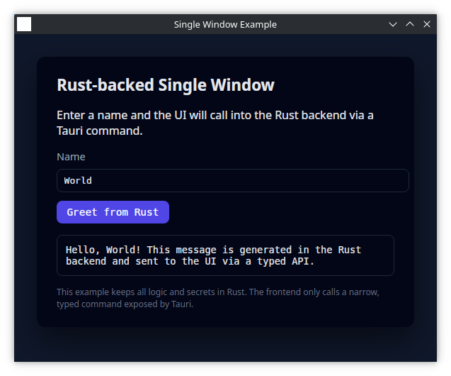

# Single Window Rust GUI Example

## Overview

This example shows a **single-window** desktop application backed by Rust.

It is intended for:

- Focused internal tools
- Simple dashboards or status panels
- Single-task utilities (e.g. data entry, quick analysis)

The emphasis is on a compact, distraction-free workflow in a single window, rather than a complex multi-screen application.

## What users see

- One main window focused on a primary task.
- A simple input area (for text, selections, or file picks).
- A primary action (for example, "run check", "generate report", or "submit").
- A results or status area that updates in place.

This layout keeps the experience simple and smooth for users.

## Technology at a glance

- Desktop application using a Rust backend with a lightweight web-based UI shell.
- Rust handles business rules, integrations, and validation.
- The visible UI focuses on layout, copy, and interactions.

## How it behaves

When someone uses the app:

1. They interact with controls in the single window (entering values, pressing buttons).
2. Those actions are passed to the Rust backend, which performs the real work.
3. The backend returns a structured outcome (success, validation messages, results).
4. The window updates in place to show the latest state.

This means the UI stays responsive and predictable, while the logic behind it can evolve independently.

## What can be customized

Within the single-window pattern, several aspects are designed to be configurable per project:

- **Visual design**: colours, typography, spacing, and branding (logos, icons, tone of copy).
- **Layout inside the window**: arrangement of inputs, summary panels, inline help text, and optional secondary sections (e.g. a compact activity feed or recent items).
- **Domain-specific actions**: what happens when users click the main button(s) – which APIs, databases, or services are called.
- **Data shown or edited**: fields in the form, columns or metrics in the results area, and how much detail is visible by default.
- **Validation and messaging**: how strictly inputs are checked and how feedback is communicated (inline hints, warnings, confirmations).

## Security and data handling

- Secrets (API keys, tokens, credentials) are loaded and stored only in the Rust layer.
- The UI never sees raw secrets and only works with high-level results or statuses.
- The pattern is suitable for connecting to internal systems while keeping sensitive details behind a controlled boundary.

